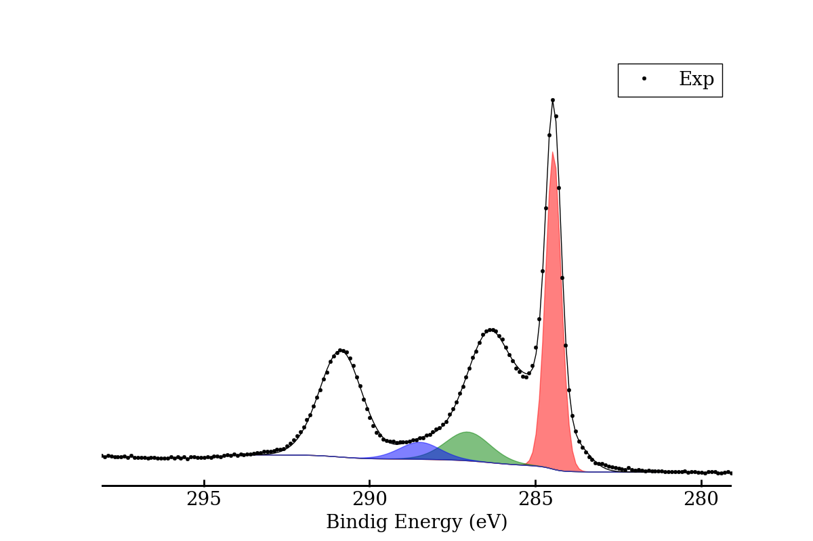
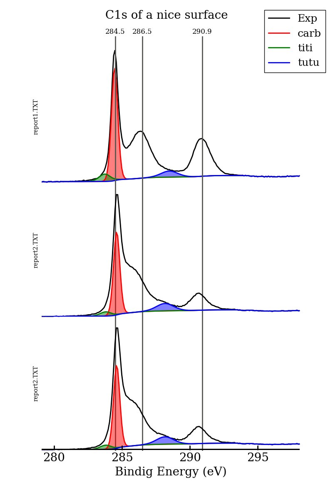

# xpsplot

python classes in order to quickly plot XPS data.

This module contains two classes in order to plot XPS data from vms data
files. There is two classes. The first one, `XPSData`, allows to plot one XPS spectra.
The second class, `StackedXPSData`, allows to plot several XPS data one above
another.

## Contents of the files

* xpsplot.py is the module which contains the classes
* read_XPS_data.ipynb contains short examples of how to use xpsplot module
* read_XPS_data_long.ipynb contains details on the implementation
* report.TXT files are the data file in vms format
* example3.py contains several examples of plots with customization options.
* plot_example.py contains an example in order to build a custum plot

Hereafter two simple examples of xps data graphical representation are shown.
They correspond to the `example.py` and `example2.py` script files.

## Example 1

This is `example.py` file in order to plot a single XPS data file

```python
import xpsplot

report1 = xpsplot.XPSData.from_file("report1.TXT")

report1.set_column_name("Comp_1", "carb")
report1.set_column_name("Comp_3", "carbonyle")
report1.set_column_name("Comp_4", "tata")
report1.set_column_name("Comp_5", "titi")
report1.set_column_name("Comp_6", "toto")
report1.set_column_name("Comp_7", "tutu")

report1.save_plot("report1.png",                                        # picture name
                  columns=["Exp", "carb", "titi", "tutu", "envelope"],  # column to plot
                  fill=True,                                            # fill component
                  fname=False)                                          # do not write file name
```

this is the output on `report1.png` file :



## Example 2

This is `example2.py` file in order to plot several data files

```python
import xpsplot

# load data and set the global title
stuff = xpsplot.StackedXPSData("report1.TXT", "report2.TXT", "report2.TXT")
stuff.title = "C1s of a nice surface"

# set column names. If "", column name is keep unchanged
stuff.set_all_column_names("", "", "carb", "", "", "tata", "toto", "titi", "tutu")

# substract background data
stuff.substract_bg()

# save the plot
stuff.save_plot("stack.png",                                          # picture name
                columns=["Exp", "carb", "titi", "tutu", "envelope"],  # column to plot
                fill=True,                                            # fill component
                pos=[284.5, 290.9, 286.5])                            # vertical line positions
```

this is the output on `stack.png` file :


